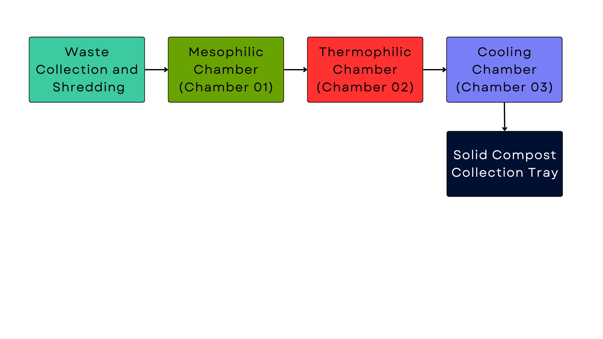

# Fully Automatic Organic Waste Composter

A fully automated, IoT-enabled composting machine that converts household organic waste into nutrient-rich compost within **10–15 days**. Built using ESP32-S3, Firebase Realtime Database, and a three-stage modular composting workflow.

## 🌱 Overview

Urban waste management faces challenges such as odour, long composting times, and lack of automation.
This project introduces a smart, compact, home-friendly composting system that automates:

- Mixing & aeration  
- Temperature control  
- Moisture regulation  
- Chamber-to-chamber waste transfer  
- Real-time alerts & remote control  

## ✨ Key Features

- Three-chamber automated composting (Mesophilic → Thermophilic → Curing)  
- ESP32-S3 real-time sensing and actuation  
- Firebase IoT backend for remote monitoring  
- Flutter mobile app for dashboard, thresholds & manual control  
- Automated heating (TRIAC) + moisture control (solenoid)  
- Odour reduction with activated carbon filters  
- Compact size suitable for urban houses  

## 🧠 System Architecture

### Sensors
- **DS18B20** – Core compost temperature  
- **DHT22** – Humidity & ambient temperature  
- **Capacitive Soil Moisture Sensor v2.0** – Moisture detection  
- **HC-SR04** – Fill-level detection  

### Actuators
- **150W AC turning motor**  
- **MG-996R servo motors** – Chamber doors  
- **Solenoid valve** – Moisture regulation  
- **Nichrome heating coil + TRIAC control**  
- **Exhaust fans with activated carbon filters**  

### Controllers
- **ESP32-S3** – Primary controller  
- **ESP32 DevKitC** – Heater PWM control  

### Software Stack
- Arduino / ESP-IDF firmware  
- Firebase (Realtime DB + Auth)  
- Flutter mobile application  

## 🖼️ System Diagrams  
(Add your images in the `images/` folder and update paths)

### 📌 Architecture Diagram

### 📌 Workflow Diagram

### 📌 Mechanical Design

## 📡 IoT Workflow

1. ESP32-S3 reads sensor data  
2. Data uploaded to Firebase  
3. Mobile app shows live readings  
4. User updates thresholds  
5. ESP32-S3 automatically adjusts actuators  

## 📦 Repository Structure
📁 firmware/
📁 mobile-app/
📁 mechanical-design/
📁 circuit-design/
📁 documentation/
README.md

## 🔧 Setup Instructions

### Requirements
- ESP32-S3 + ESP32 DevKitC  
- Firebase project  
- Flutter SDK  
- Sensors & actuators listed above  

### Steps
1. Upload firmware  
2. Configure Firebase  
3. Install & run Flutter app  
4. Assemble mechanical structure  
5. Connect sensors & actuators  
6. Start system and monitor live  

## 🧪 Results

- 60% faster composting time (10–15 days)  
- Stable temperature & moisture control  
- Reliable actuator response  
- Odour-free operation  

## 🔮 Future Enhancements

- Solar-powered version  
- AI-based compost quality prediction  
- Automatic waste sorting attachment  
- Scalable institutional model  
- Commercial production-ready variant  

## 👥 Authors

- **M.L.A. Arshad**  
- **M.H.H. Ahmad**  
- **A.A.M. Nafrees**

## 👥 Supervisors

Faculty of Technology, University of Colombo
